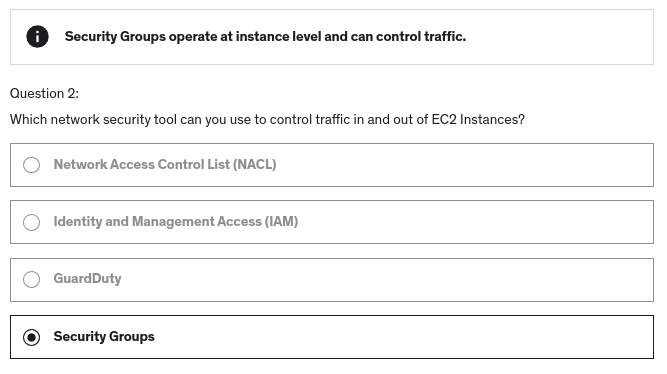
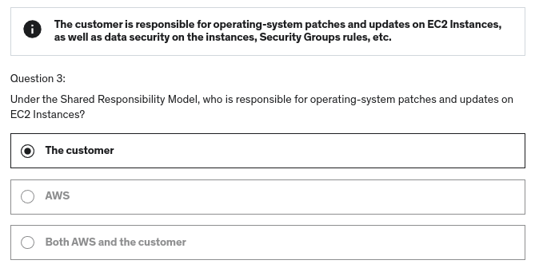
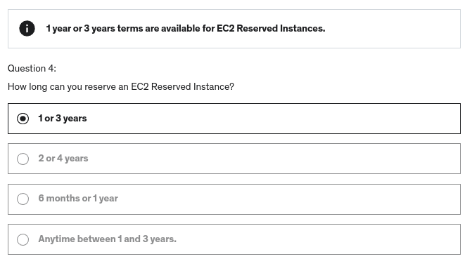
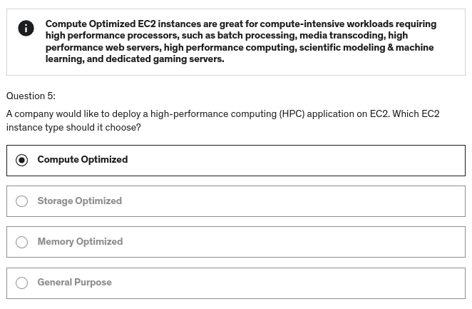
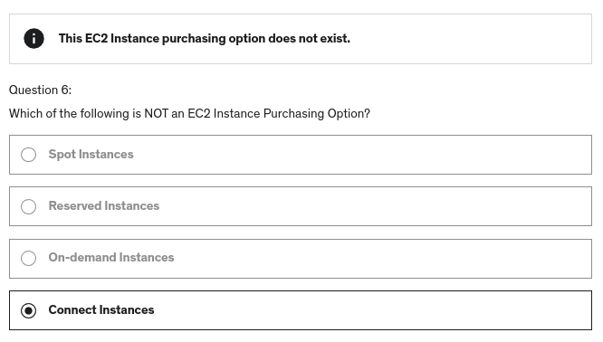
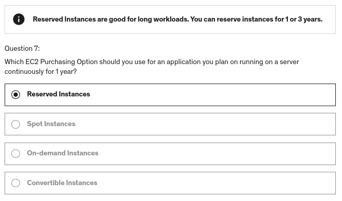

###### [_↩ Back to `homepage`_](./../../../README.md)

###### 🌈 Table of contents
- ##### [Section 5. EC2 - Elastic Compute Cloud](#section-5-ec2---elastic-compute-cloud-1)
  - ##### [45. Instance Roles Demo](#45-instance-roles-demo-1)
  - ##### [46. EC2 Instance Purchasing Options](#46-ec2-instance-purchasing-options-1)
  - ##### [47. Shared Responsibility Model for EC2](#47-shared-responsibility-model-for-ec2-1)
  - ##### [48. EC2 Summary](#48-ec2-summary-1)
  - ##### [Quiz 3: EC2 Quiz](#quiz-3-ec2-quiz-1)

# [Section 5. EC2 - Elastic Compute Cloud](#section-5-ec2---elastic-compute-cloud)

## [45. Instance Roles Demo](#45-instance-roles-demo)
- `aws` CLI is installed by default inside the **EC2** instances.
- Users can use `aws` CLI to access the AWS services, such as list **IAM** users,...
- However, if we want to access other AWS services, such as **S3**, we need to configure the `aws` CLI with the **Access Key** and **Secret Key**. This is not a good practice because the **Access Key** and **Secret Key** are stored inside the **EC2** instance and can be stolen by people who have access to the **EC2** instance and log in to the instances later.
- To solve the third bullet problem, AWS allows us to create **IAM Roles** and assign them to the **EC2** instances. Then, the **EC2** instances can access the AWS services without using the **Access Key** and **Secret Key**.

## [46. EC2 Instance Purchasing Options](#46-ec2-instance-purchasing-options)
* Depends on the use case, your workload, and your budget, you can choose the most suitable **EC2** instance purchasing option.
* There are several options:
  * **On-Demand**: Pay as you go. No long-term commitment. Short workload, predictable pricing, and pay by second.
  * **Reserved**: Up to 75% discount compared to **On-Demand**. 1 or 3 year terms. If you intend to have a long workload (such as running a Database service inside the EC2 instance for a long time), you can choose this option.
  * **Convertible Reserved**: Similar to **Reserved**, but you can change the instance type if the workload changes. Up to 54% discount.
  * **Saving Plans**: Up to 72% discount. You commit to a specific amount of compute usage (measured in $/hour) for a 1 or 3 year term. You can choose to pay for the usage monthly or all upfront.
  * **Spot**: Up to 90% discount compared to **On-Demand**. Can lose instances if the **spot price** is higher than your **bid price**.
    * **Spot price**: The price of the instance at the current time.
    * **Bid price**: The price that you are willing to pay for the instance.
  * **Dedicated Hosts**: Physical dedicated EC2 server. Control instance placement.
  * **Dedicated Instances**: Instances running on hardware that's dedicated to you. May share hardware with other instances in the same account.
  * **Capacity Reservations**: Reserve capacity for your EC2 instances in a specific Availability Zone for any duration. This option is suitable for predictable workloads that require a specific type of instance all the time.
* Compare prices between different options.

## [47. Shared Responsibility Model for EC2](#47-shared-responsibility-model-for-ec2)
* **AWS**:
  * AWS is going to be responsible for **all data centers**, their **infrastructure**, and **physical security** of the hardware.
  * Make sure that you have isolation on the physical host if you are getting, for example, a **dedicated host**.
  * Replacing faulty hardware.
  * Make sure that they are still compliant with the **regulations** that they have agreed to.

* **Users**:
  * Define your own **Security Groups** rules.
  * You own the entire VM inside of your **EC2** instance, so you are responsible for patching the OS, installing the software, and configuring the network, not AWS.
  * **IAM roles** assigned to EC2 instance and **IAM user access management**.
  * **Data security** on your instance.

## [48. EC2 Summary](#48-ec2-summary)
* **EC2 Instance**: AMI (OS) + Instance Size (CPU + RAM) + Storage + **Security Groups** + **EC2 User Data**.
- **Security Groups**: Firewall attached to the EC2 instance.
- **EC2 User Data**: Script launched at the first start of an instance.
- **SSH**: start a terminal into our EC2 Instances (port 22).
- **EC2 Instance Role**: link to **IAM roles**.
- **Purchasing Options**: On-Demand, Spot, Reserved (Standard + Convertible + Scheduled), Dedicated Host, Dedicated Instance

## [Quiz 3: EC2 Quiz](#quiz-3-ec2-quiz)
- Quiz 1: 
  

- Quiz 2: 
  

- Quiz 3: 
  

- Quiz 4: 
  

- Quiz 5: 
  

- Quiz 6: 
  

- Quiz 7: 
  
