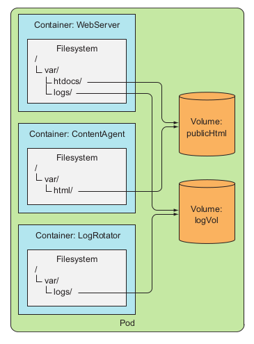
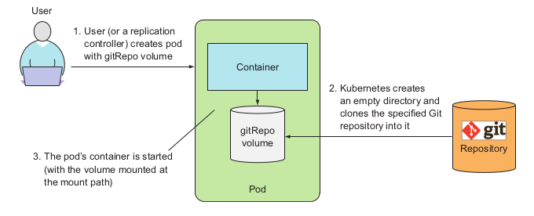
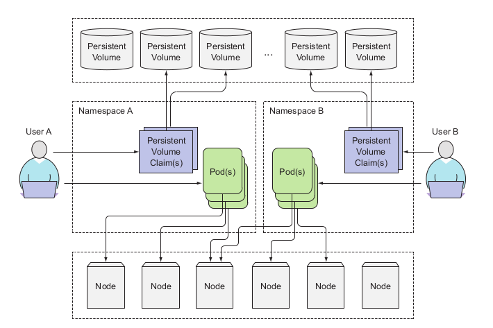

# Chapter 6. Volumes: attching disk storage to containers
## 6.1. Introducing volumes
* K8s volumes are a component of a pod and are defined in the pod's specification.
* A volume is available to all containers in a pod, but it must be mounted in each container that needs to access it.
### 6.1.1. Explaining volumes in an example
* Imagine you have a pod with three containers:
    * **Web server**: servers HTML pages from the `/var/htdocs` directory and stores the access log to `/var/logs`.
    * **Content Agent**: runs an agent that creates HTML files and stores them in `/var/html` directory.
    * **Log Rotator**: processes the logs it finds in the `/var/logs` directory and rotates them.
    * The below image shows three containers of the same pod without shared storage.<br>
    <br>
    * The below image shows three containers sharing two volumes mounted at various mount paths.<br>
    <br>

### 6.1.2. Introducing available volume types
* Here is a list of several of the available volume types:
    * `emptyDir`: A simple empty directory used for storing transient data.
    * `hostPath`: Used for mounting directories from the worker node's filesystem into the pod.
    * `gitRepo`: A volume initialized by checking out the contents of a Git repository.
    * `nfs`: An NFS share mounted into the pod.
    * Cloud provider volumes used for mounting cloud provider-specific storage into the pod:
        * `gcePersistentDisk`: Google Compute Engine Persistent Disk.
        * `awsElasticBlockStore`: Amazon Elastic Block Store.
        * `azureDIsk`: Microsoft Azure Disk.
    * `cinder`, `cephfs`, `iscsi`, `flocker`, `glusterfs`, `quobyte`, `rbd`, `flexVolume`, `vsphereVolume`, `photonPersistentDisk`, `scaleIO`: used for mounting other types of network storage.
    * `configMap`, `secret`, `downwardAPI`: special types of volumes used to expose certain K8s resources and cluster information to the pod.
    * `persistentVolumeClaim`: used for mounting persistent storage into the pod.
    * ... and others.
## 6.2. Using volumes to share data between containers
* This section discusses how to use volumes to share data between containers in a pod.
### 6.2.1. Using `emptyDir` volumes
* The app running inside the pod can then write any files it needs to it.
* The volume's lifetime is tied to the pod's lifetime, the volume's contents are deleted when the pod is deleted.
* An `emptyDir` volume is especially useful for sharing files between containers running in the same pod.
* It can also be used be a **single container** for when a container needs top write data to disk temporarily, such as when performing a sort operation on a large dataset, which can not fit into the available memory.

###### Using an `emptyDir` volume in a pod
* Using the previous example where a **web server**, a **content agent**, and a **log rotator** share two volumes, but let's simplify a bit.
* You will build a pod with **only the web server container** and **the content agent** and a **single volume** for the HTML.
* We use Nginx as the web serverm and the and the UNIX `fortune` _(this command will print out a random quote every time you run it)_ command to generate HTML content. You will create a script that invokes the `fortune` command every 10 seconds and stores its output in `index.html`.
* The first step, let's build the `fortune` container image using [this Dockerfile](./resources/me/chap06/fortune/Dockerfile).
    ```bash
    docker image build -t manhcuong8499/fortune -f ./resources/me/chap06/fortune/Dockerfile ./resources/me/chap06/fortune/
    docker image push manhcuong8499/fortune
    ```

###### Creating a pod
* Working file [fortune-pod.yaml](./resources/me/chap06/fortune-pod.yaml).
* Create the pod:
    ```bash
    kubectl apply -f ./resources/me/chap06/fortune-pod.yaml
    ```
    
    * The pod contains two containers and a single volume.

###### Seeing the pod in action
* To see the fortune message, you need to access to the pod. You will do that by forwarding a port from your local machine to the pod.
* Forward port 8080 on your local machine to port 80 on the pod:
    ```bash
    kubectl port-forward pod/fortune 8080:80
    ```
    
    

###### Specifying the medium to use for the `emptyDir`
* The `emptyDir` you used as the volume was created on the actual disk of the worker node hosting your pod, so its performance depends on the type of the node's disks.
* You can tell K8s to create `emptyDir` on a **tmpfs** _(in memory instead of on disk)_. To do this, set the `emptyDir`'s `medium` property to `Memory` like this:
    ```bash
    volumes:
    - name: html
      emptyDir:
        medium: Memory
    ```

### 6.2.2. Using a Git repository as the starting point for a volume
* A `gitRepo` volume is basically an `emptyDir` volume that gets populated by cloning a Git repository and checking out a specific revision when the pod is starting up _(but before its containers are created)_.
    

* After the `gitRepo` volume is created, it is not kept in sync with the repo it is referencing. The files in the volume will not be updated when you push additional commits to the Git repository.
* Working file [gitrepo-volume-pod.yaml](./resources/me/chap06/gitrepo-volume-pod.yaml)
    ```bash
    kubectl apply -f ./resources/me/chap06/gitrepo-volume-pod.yaml
    ```

* **Note**: `gitRepo` has not been supported since Kubernetes v1.16.0.

## 6.3. Accessing files on the worker node's filesystem
* Working file: [fortune-hostpath.yaml](./resources/me/chap06/fortune-hostpath.yaml).
* Create the pod:
    ```bash
    kubectl apply -f ./resources/me/chap06/fortune-hostpath.yaml
    ```
* We can also see the `index.html` file has been created on the worker node's filesystem.
    

* Find more in this [link](https://www.devopsschool.com/blog/kubernetes-volume-hostpath-explained-with-examples/).
* Describe the `pod/fortune` we also see the `hostPath` volume is mounted at `/data`:
    ```bash
    kubectl describe pod/fortune
    ```
    

## 6.4. Using persistent storage
* Learn more in book.
## 6.5. Decoupling pos from the underlying storage technology.
### 6.5.1. Introducing PersistentVolumes and PersistentVolumeClaims

### 6.5.2. Creating a PersistentVolume
* Working file: [mongodb-pv-hostpath.yaml](./resources/me/chap06/mongodb-pv-hostpath.yaml).
* Create the PV:
    ```bash
    kubectl apply -f ./resources/me/chap06/mongodb-pv-hostpath.yaml
    kubectl get pv
    ```
    

* PersistentVolumes like cluster nodes, do not belong to any namespace, unlike pods and PersistentVolumeClaims.
    

### 6.5.3. Claiming a PersistentVolume by creating a PersistentVolumeClaim
###### Creating a PersistentVolumeClaim
* Working file: [mongodb-pvc.yaml](./resources/me/chap06/mongodb-pvc.yaml).
* Create the PVC:
    ```bash
    kubectl apply -f ./resources/me/chap06/mongodb-pvc.yaml
    kubectl get pvc
    ```
    

* The PersistentVolume's capacity must be large enough to accommodate what the claim requests.
* The volume's access modes must include the access mode requested by the claim.
* Some kinds of access modes:
    * `ReadWriteOnce` - `RWO`: the volume can be mounted as read-write by a single node.
    * `ReadOnlyMany` - `ROX`: the volume can be mounted read-only by many nodes.
    * `ReadWriteMany` - `RWS`: the volume can be mounted as read-write by many nodes.
    * **Note**: `RWO`, `ROX`, and `RWX` pertain to the number of worker nodes that can use the volume at the same time, not to the number of pods.

### 6.5.4. Using a PersistentVolumeClaim in a pod
* Find more in the book.

## 6.6. Dynamic provisioning of PersistentVolumes
* See more in this [link](https://viblo.asia/p/kubernetes-series-bai-7-persistentvolumeclaims-tach-pod-ra-khoi-kien-truc-storage-ben-duoi-6J3Zgyeq5mB) and book.
