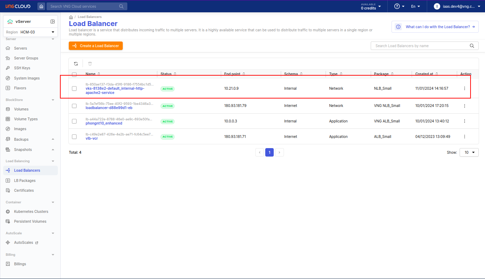
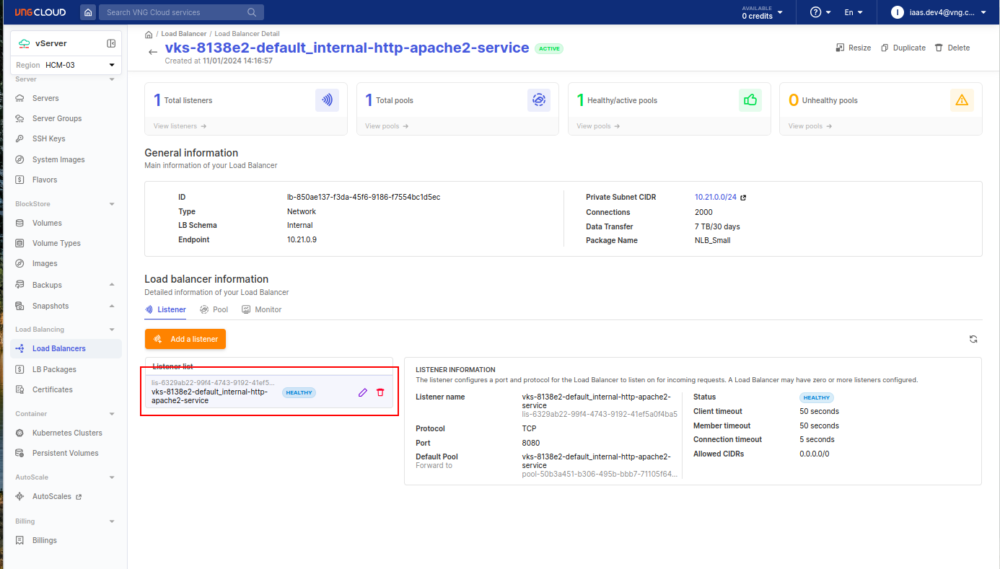

# 1. Scenario
- File [internal-httpd-service.yaml](./../manifests/internal/internal-httpd-service.yaml)
- This testcase creates an `Apache2` deployment, and then create an **INTERNAL** loadbalancer service to expose the deployment.

- Apply the manifest
```bash
kubectl apply -f internal-httpd-service.yaml
```

# 2. Test
After applying the manifest, we will have a deployment and a service as below:
- Get Apache2 deployment with 2 replicas
```bash
kubectl get deploy
```


```bash
kubectl get svc
```

> - The internal IP address of the load balancer is `10.21.0.9`.

- To test this case, you can create an Ubuntu pod using host network and then exec to this pod, install `curl` cli tool and make GET request to this IP address.

- Apply file [ubuntu-pod.yaml](./../manifests/internal/ubuntu-pod.yaml)
```bash
kubectl apply -f ubuntu-pod.yaml
kubectl get pods
```


- Exec to this pod
```bash
kubectl exec -it ubuntu-pod -- bash

# inside the ubuntu-pod
apt update && apt install curl -y
```


- Make GET request to the internal IP address of the load balancer
```bash
curl http://10.21.0.9:8080
```


- Check load balancer in the portal UI


- Check the listener


- Check the backend pool
