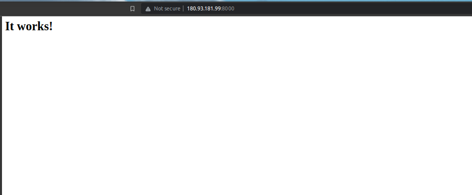

- To do this lab, you need to complete the guildline [udp-server.md](./udp-server.md) to prepare the environment before starting this lab.
- After the loadbalancer is created, go to the portal to get the loadbalancer UUID, for example: `lb-3b8b7ae5-2840-49e6-bf82-9f8c2f82f631`

- Apply the file [reuse-lb.yaml](./../manifests/reuse-lb/reuse-lb.yaml)
```yaml
apiVersion: apps/v1
kind: Deployment
metadata:
  name: http-apache2-deployment
spec:
  replicas: 2
  selector:
    matchLabels:
      app: apache2
  template:
    metadata:
      labels:
        app: apache2
    spec:
      containers:
        - name: apache2
          image: httpd
          ports:
            - containerPort: 80
---
apiVersion: v1
kind: Service
metadata:
  name: http-apache2-service
  annotations:
    vks.vngcloud.vn/load-balancer-id: "<PUT_THE_LB_ID_HERE>"  # IMPORTANT
spec:
  selector:
    app: apache2
  type: LoadBalancer
  ports:
    - name: http
      protocol: TCP
      port: 8000
      targetPort: 80
```

- Then apply the file
```bash
kubectl apply -f reuse-lb.yaml
```

- Access from the browse at the address: `http://<PUBLIC_IP_ADDRESS>:8000`
