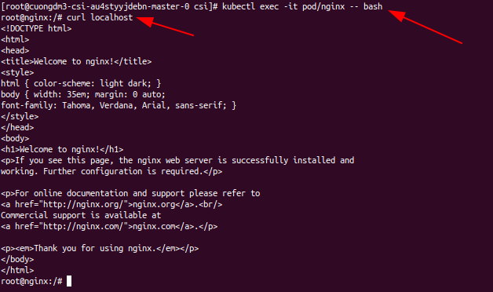
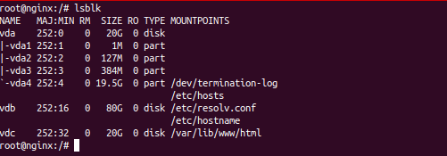

###### [↩ Back to `README`](./../README.md)

# 3. Demo block storage
## 3.1. Creating
- The below manifest will create one `StorageClass` `my-storage-class`, one `PersistentVolumeClaim` `my-pvc` and one `Pod` `nginx`.
- The volume type _(tag `[5]` in the below manifest)_ can be found here [https://hcm-03.console.vngcloud.tech/vserver/block-store/volume-type](https://hcm-03.console.vngcloud.tech/vserver/block-store/volume-type), for example: `vtype-69d77715-b8c4-43e0-ad15-3dc01e2a90e1`.
- The manifest [`block.yaml`](./../manifest/block/block.yaml)
  ```yaml
  apiVersion: storage.k8s.io/v1
  kind: StorageClass
  metadata:
    name: my-storage-class  # [1] The StorageClass name, CAN be changed
  provisioner: csi.vngcloud.vn  # The VNG-CLOUD CSI driver name
  parameters:
    type: <PUT_VOLUME_TYPE_UUID>  # [5] Change it to your volume type UUID

  ---
  apiVersion: v1
  kind: PersistentVolumeClaim
  metadata:
    name: my-pvc  # [2] The PVC name, CAN be changed
  spec:
    accessModes:
    - ReadWriteOnce  # MUST set this value, currently only support RWO
    resources:
      requests:
        storage: 20Gi  # [3] The PVC size, CAN be changed, this value must be in the valid range of the proper volume type
    storageClassName: my-storage-class  # MUST be same value with [1], not set this value will use default StorageClass

  ---
  apiVersion: v1
  kind: Pod
  metadata:
    name: nginx
  spec:
    containers:
    - image: nginx
      imagePullPolicy: Always
      name: nginx
      ports:
      - containerPort: 80
        protocol: TCP
      volumeMounts:
        - mountPath: /var/lib/www/html  # The mount path in container, CAN be changed
          name: my-volume-name  # MUST be same value with [4]
    volumes:
    - name: my-volume-name  # [4] The volume mount name, CAN be changed
      persistentVolumeClaim:
        claimName: my-pvc  # MUST be same value with [2]
        readOnly: false
  ```
- Apply the `block.yaml` manifest
  ```bash
  kubectl apply -f block.yaml
  ```
  > 

- After the manifest is applied successful, these resources will be created:
  ```bash
  kubectl get sc -owide
  kubectl get pvc -owide
  kubectl get pv -owide
  ```
  > 

- Check the pod `nginx` is running
  ```bash
  kubectl get pod -owide
  ```
  > 
  - The pod `nginx` is running on the `worker-0` node, the `worker-0` node is the node that the `PersistentVolume` is created on.

- Exec to node to check the volume is created
  ```bash
  kubectl exec -it pod/nginx -- bash

  # inside the pod `nginx`
  curl localhost
  ```
  > 

- Using `lsblk` command:
    ```bash
    # inside the pod `nginx`
    lsblk
    ```
    > 
  
- Verify from portal.
  
## 3.2. Deleting
- To delete `PersistentVolume`, you **MUST** delete the resource that use it first, in this case is the `Pod` `nginx`, and then delete the `PersistentVolumeClaim` `my-pvc`. Else, the entire process will be failed, because VNG-CLOUD CSI driver will not allow to delete the volume that is `IN-USE` status.
  ```bash
  kubectl delete pod nginx
  kubectl delete pvc my-pvc
  ```

- Right after the pod `nginx` is deleted, the volume will be in `DETACHING` status in the portal.
  
- And then it will be deleted after a few seconds.
  
  